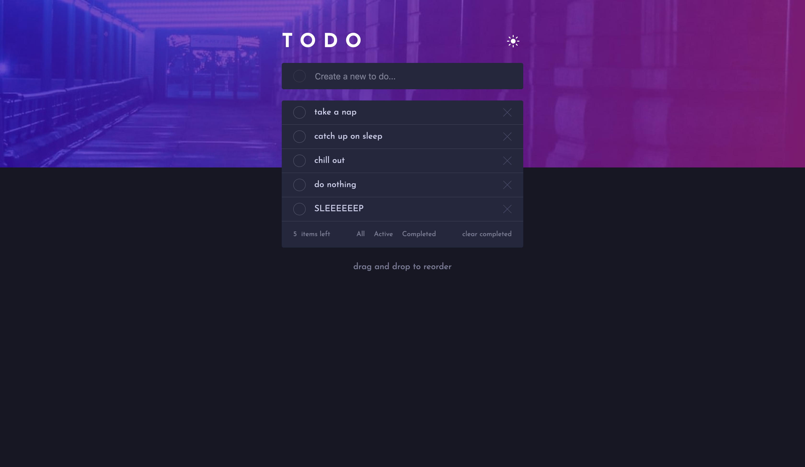
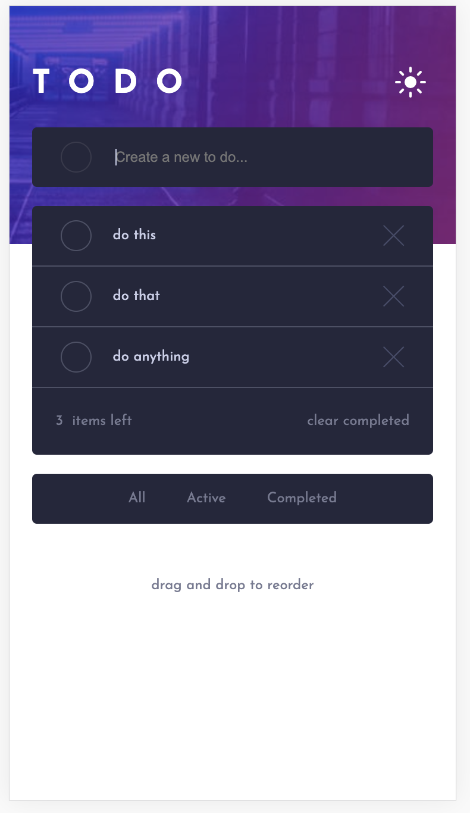

# Frontend Mentor - Todo app solution

This is my solution to the [Todo app challenge on Frontend Mentor](https://www.frontendmentor.io/challenges/todo-app-Su1_KokOW). I used Frontend Mentor to improve my frontend coding skills by building realistic projects.

## Table of contents

- [Overview](#overview)
  - [The challenge](#the-challenge)
  - [Screenshot](#screenshot)
  - [Links](#links)
- [My process](#my-process)
  - [Built with](#built-with)
  - [What I learned](#what-i-learned)
  - [Continued development](#continued-development)
  - [Useful resources](#useful-resources)

## Overviewl

### The challenge

Users should be able to:

- View the optimal layout for the app depending on their device's screen size
- See hover states for all interactive elements on the page
- Add new todos to the list
- Mark todos as complete
- Delete todos from the list
- Filter by all/active/complete todos
- Clear all completed todos
- Toggle light and dark mode
- Drag and drop to reorder items on the list

### Screenshot




### Links

[Live Site URL](https://laleonie.github.io/To-Do-App/)

## My process

### Built with

- Semantic HTML5 markup
- CSS custom properties
- Flexbox
- CSS Grid
- Vanilla JavaScript

### What I learned

- In replicating the provided design, I learned a lot about using background images in CSS. For instance, I learned to create a custom checkbox by adding two background images on top of each other.

```css
.checkbox.checkbox-tick {
  background-image: url("./images/icon-check.svg"), linear-gradient(135deg, #55ddff
        0%, #c058f3 100%);
  background-position: center;
  background-repeat: no-repeat;
  border: 1px solid;
  border-image: linear-gradient(135deg, #55ddff 0%, #c058f3 100%) 1;
}
```

- I was careful to keep my code DRY and all functions pure, for instance by extracting the counter functionality into a separate **updateNumberOfUnchecked** function.

```js
const updateNumberOfUnchecked = () => {
  allTodos = document.querySelectorAll("li");
  allChecked = document.querySelectorAll(".checkedItem");
  numberOfUnchecked = allTodos.length - allChecked.length;
  document.querySelector(
    "#numberOfUnchecked"
  ).innerHTML = `${numberOfUnchecked}`;
};
```

- I learned to execute media queries with JavaScript instead of CSS. This approach was necessary to add event listeners to a DOM element that is hidden in desktop view. The mobileFilterHandler function calls functions that are also called in the desktop event listeners.

```js
const mediaQuery = window.matchMedia("(max-width: 375px)");

if (mediaQuery.matches) {
  document
    .querySelector(".filter-group.mobile")
    .addEventListener("click", mobileFilterHandler);
}
```

- I learned to add drag & drop functionality to reorder the list, using the helper function **getDragAfterElement** to identify the closest next list item.

```js
const getDragAfterElement = (container, y) => {
  const draggableElements = [
    ...container.querySelectorAll("li:not(.dragging)"),
  ];
  return draggableElements.reduce(
    (closest, child) => {
      const box = child.getBoundingClientRect();
      const offset = y - box.top - box.height / 2;
      if (offset < 0 && offset > closest.offset) {
        return { offset: offset, element: child };
      } else {
        return closest;
      }
    },
    {
      offset: Number.NEGATIVE_INFINITY,
    }
  ).element;
};
```

### Continued development

This project has highlighted to me, that I need to ...

- use CSS naming methodologies to keep my stylesheet neater
- learn more about CSS layout
- learn more JavaScript patterns to refactor my code

### Useful resources

- [How To Build Sortable Drag & Drop With Vanilla Javascript](https://www.youtube.com/watch?v=jfYWwQrtzzY&ab_channel=WebDevSimplified) - I used this tutorial to learn how to implement the drag & drop functionality.
